# 【Monaca × ニフクラ mobile backend】写真投稿アプリを作ろう！
<center>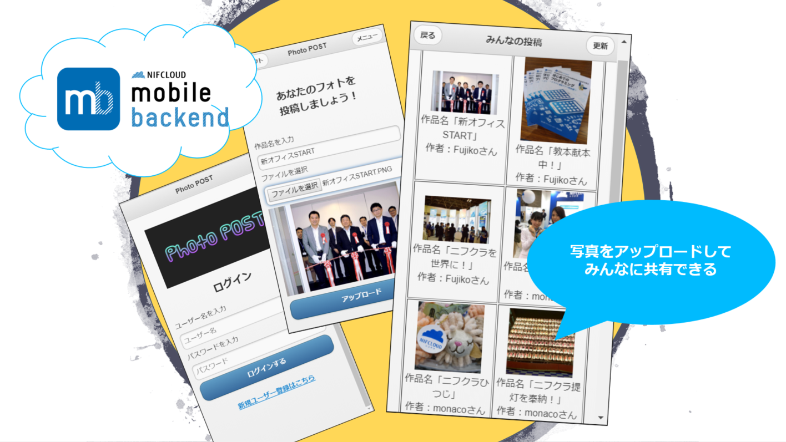</center>

## 目次
* 概要
* ニフクラ mobile backend って何？？
* 事前準備
* サンプルアプリの実行までの作業手順
* サンプルアプリの使い方
* 解説

## 概要
* お気に入りの写真をアプリに投稿し、ユーザー同士で写真を共有できるサンプルアプリです
* ニフクラ mobile backend の「データストア・会員管理・ファイルストア」機能を利用して、写真をクラウドに保存し共有しています
* 簡単な操作ですぐに ニフクラ mobile backend の機能を体験いただけます

## ニフクラ mobile backend って何？？
スマートフォンアプリのバックエンド機能(注1)が開発不要なうえ、基本無料で使えるクラウドサービスです

<center>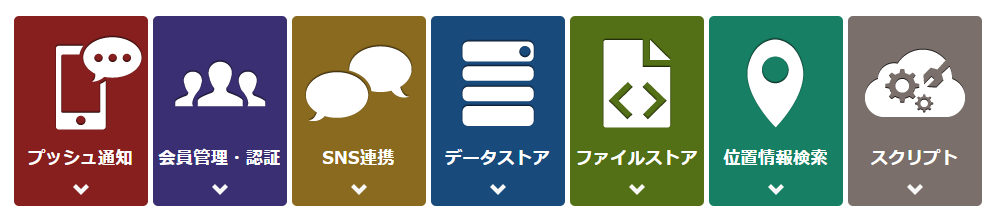</center>

注1：プッシュ通知・データストア・会員管理・ファイルストア・SNS連携・位置情報検索・スクリプト

## 事前準備
* ニフクラ mobile backend アカウントの取得（無料登録）
  * ➡ URL <a href="https://mbaas.nifcloud.com/signup.htm" target="_blank">https://mbaas.nifcloud.com/signup.htm</a>
* Monacaアカウントの取得（無料登録）
  * ➡ URL <a href="https://ja.monaca.io/free-plan.html" target="_blank">https://ja.monaca.io/free-plan.html</a>

## サンプルアプリの実行までの作業手順
### 1. Monacaにプロジェクトをインポートしアプリを起動する<br>
* Monacaにログインをします
* 下記URLにアクセスします
  - ➡ URL <a href="http://bit.ly/KondoYutaro_PhotoPost" target="_blank">http://bit.ly/KondoYutaro_PhotoPost</a>
* 「インポート」をクリックして、「Photo POST」プロジェクトをインポートします

<center>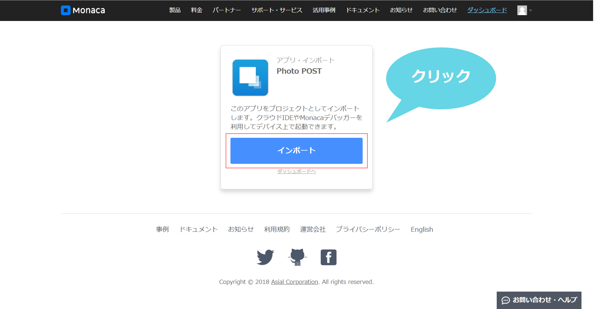</center>

* Monaca の Dashboard にプロジェクトが追加されるので、プロジェクトを選択し、「クラウドIDEで開く」をクリックします

<center>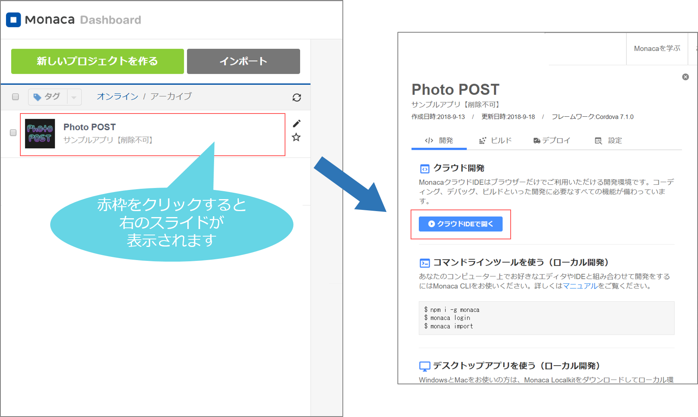</center>

* プロジェクトが開かれます

<center></center>

### 2. mobile backend SDK の導入
* 「設定」＞「JS/CSSコンポーネントの追加と削除...」をクリックします
* 「ncmb」と入力して「検索する」をクリックします

<center></center>

* 「ncmb」が表示されたら「追加」をクリックします
* SDKのバージョンはそのまま（最新）で、「インストール」をクリックします
* 「components/ncmb/ncmb.min.js」にチェックを入れて「保存」をクリックします

<center></center>

* 一覧に表示されれば導入完了です

<center></center>

### 3. ニフクラ mobile backend でアプリの作成とAPIキーの発行
* ブラウザの別のタブで ニフクラ mobile backend にログインします
* 「アプリの新規作成」画面が表示されますので、「`PhotoPOSTdemo`」と入力してアプリを新規作成します
  - 既に ニフクラ mobile backend を利用したことがある方は、下図のように緑のボタン「＋新しいアプリ」をクリックすると「アプリの新規作成」画面が表示されます

<center>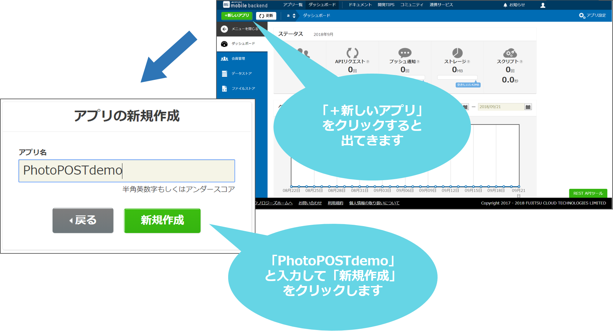</center>

* アプリ作成が完了するとAPIキーが発行されます
* この２種類のAPIキー（アプリケーションキーとクライアントキー）は Monaca で作成するアプリに ニフクラ mobile backend を紐付けるために使用されます

<center>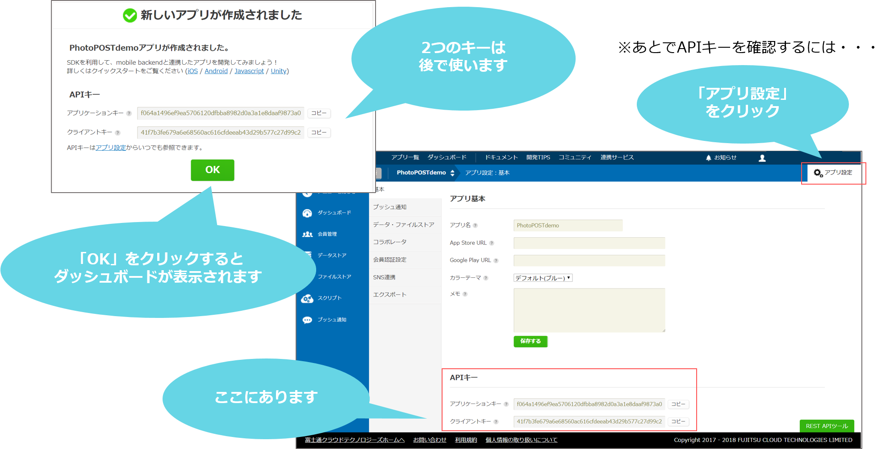</center>

### 4. ニフクラ mobile backend のAPIキーの設定
* 再び Monaca で開いたプロジェクトのタブに戻ります
* ディレクトリで、「www」フォルダ ＞「js」フォルダ（①） 開いて「app.js」ファイル(②）をダブルクリックして開きます（③）

<center>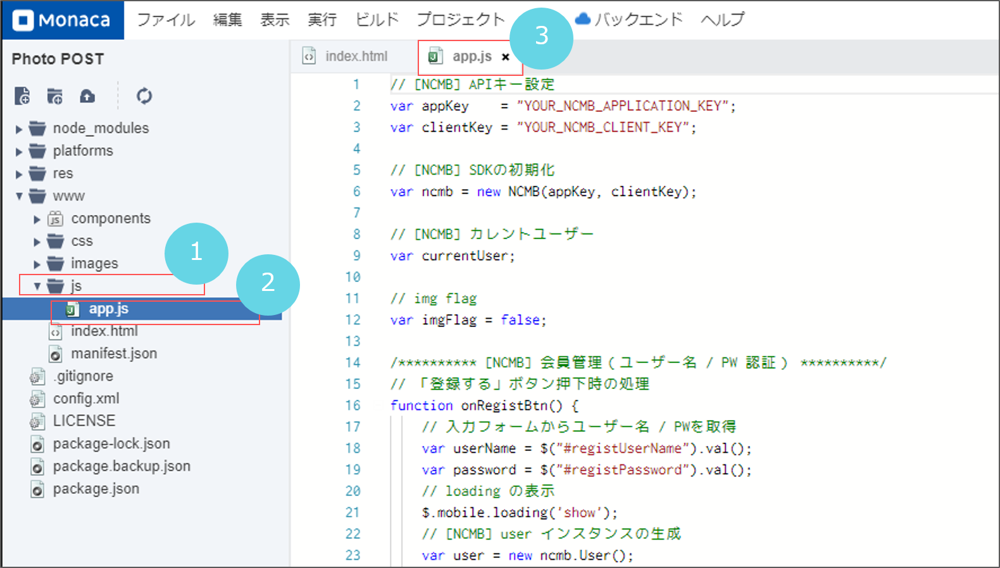</center>

* 「`YOUR_NCMB_APPLICATION_KEY`」と「`YOUR_NCMB_CLIENT_KEY`」の部分を、先程 ニフクラ mobile backend の管理画面上で確認したAPIキーに書き換えます
  - このとき、ダブルクォーテーション（`"`）を消さないように注意してください

<center>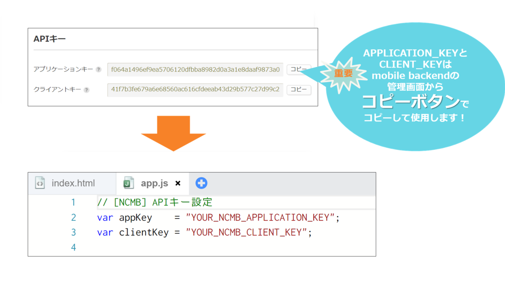</center>

* 書き換えが終わったら、ツールバーにある「ファイル」から「保存」をクリックして変更内容を保存します

これで準備はすべて完了です。

## サンプルアプリの使い方
<center>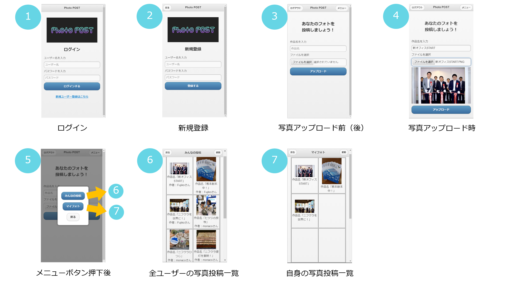</center>

* 新規ユーザー登録を行います
* ログイン画面（①）の一番下「新規ユーザー登録はこちら」をクリックします
* 新規登録画面（②）が表示されるので、ユーザー名とパスワードを入力して「登録する」ボタンを押します
  - ユーザー名は英数字のみ使用が可能です
  - 登録が完了すると自動的にログインされます
  - 一度ユーザー登録を行ったら、次回からはログイン画面よりログインできます（①）
- ニフクラ mobile backend の管理画面を確認するとユーザー情報が登録されていることを確認できます

<center>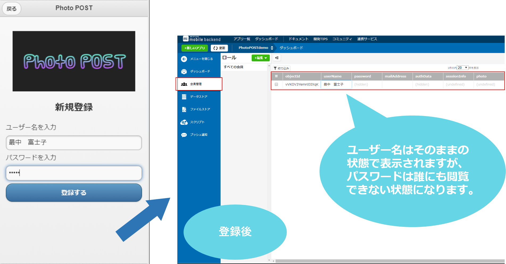</center>

* 写真を投稿します（③）
* 写真のタイトル名を記入し、写真を画像フォルダから選択します（④）
* 「アップロード」ボタンを押すと写真の投稿が完了（ ニフクラ mobile backend 上にデータが保存）されます（④）
- ニフクラ mobile backend の管理画面を確認すると画像が登録されていることを確認できます
  - 「ダウンロード」をクリックして確認できます

<center>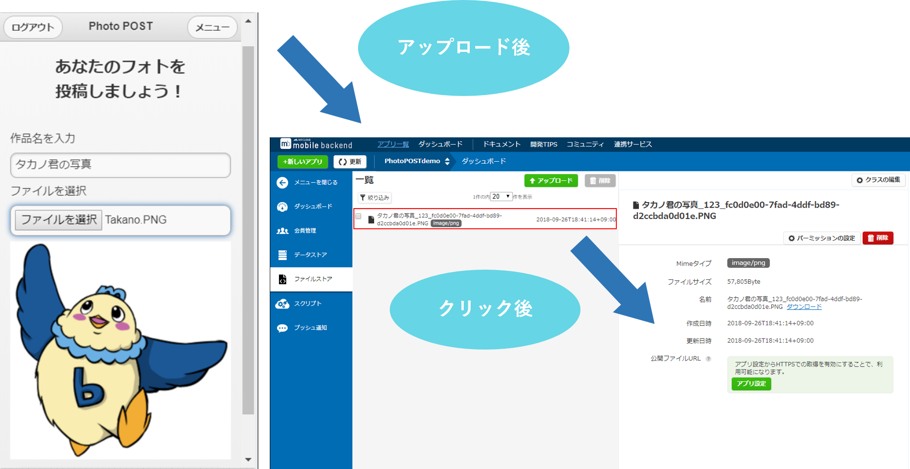</center>

* 投稿された写真は「みんなの投稿」画面（⑥）と「マイフォト」画面（⑦）に表示（ニフクラ mobile backend からデータを取得）されます

<center>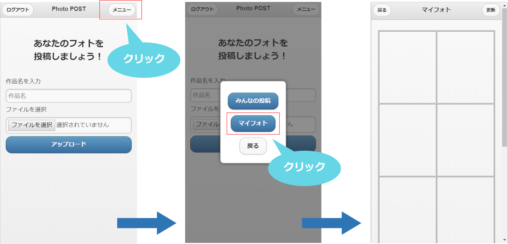</center>

- 「みんなの投稿」：アプリユーザーが投稿した最新の写真（10件）を閲覧できる画面
- 「マイフォト」：投稿者自身の写真だけを閲覧できる画面

## 解説
* 「index.html」ファイルでアプリ画面のデザインを作成し、「app.js」ファイルにロジックを書いています
* 「app.js」ファイル上に記述している ニフクラ mobile backend 関連処理（新規ユーザー登録、ログイン＆ログアウト、画像のアップロードとダウンロード）を抜粋してご紹介します

### 新規ユーザー登録と登録後の自動ログイン
* 新規登録画面で「登録する」ボタンが押されたとき、`onRegistBtn` メソッドが読み込まれます

```javascript
// 「登録する」ボタン押下時の処理
function onRegistBtn() {
    // 入力フォームからユーザー名 / PWを取得
    var userName = $("#registUserName").val();
    var password = $("#registPassword").val();

    // [NCMB] user インスタンスの生成
    var user = new ncmb.User();
    // [NCMB] ユーザー名 / PWで新規登録
    user.set("userName", userName)
          .set("password", password)
          .signUpByAccount()
          .then(function(user) {
              /* 処理成功 */
              // [NCMB] userインスタンスでログイン
              ncmb.User.login(user)
                      .then(function(user) {
                          /* 処理成功 */

                      })
                      .catch(function(error) {
                          /* 処理失敗 */

                      });
          })
          .catch(function(error) {
              /* 処理失敗 */

          });
}
```

* `.set(key, value)`　：「`key`」フィールドに値「`value`」を設定します
* `.signUpByAccount()`　：新規ユーザー登録を実行します
* `.login(user)`　：新規登録されたユーザーインスタンス「`user`」でログインを実行します

### ログイン
* ログイン画面で「登録する」ボタンが押されたとき、`onLoginBtn` メソッドが読み込まれます

```javascript
// 「ログインする」ボタン押下時の処理
function onLoginBtn() {
   // 入力フォームからユーザー名 / PWを取得
   var username = $("#loginUserName").val();
   var password = $("#loginPassword").val();

   // [NCMB] ユーザー名 / PWでログイン
   ncmb.User.login(username, password)
                  .then(function(user) {
                      /* 処理成功 */

                  })
                  .catch(function(error) {
                      /* 処理失敗 */

                  });
}
```

* `ncmb.User.login(username, password)`　：「`username`」と「`password`」でログインを実行します

### ログアウト
* 「ログアウト」ボタンが押されたとき、`onLogoutBtn` メソッドが読み込まれます

```javascript
function onLogoutBtn() {  
    // [NCMB] ログアウト
    ncmb.User.logout();
}
```

* `ncmb.User.logout();`　：ログアウトを実行します

### カレントユーザーの取得

新規登録・ログイン成功時にカレントユーザー（現在ログイン中のユーザー）を取得しています。

```javascript
// カレントユーザーの取得
currentUser = ncmb.User.getCurrentUser();
```

### 写真のアップロード

```javascript
// 写真アップロード
ncmb.File
    .upload(photoName, photoData, acl)
    .then(function(result){
        // アップロード成功時の処理

    })
    .catch(function(error){
        // アップロード失敗時の処理

    });
}
```

* `ncmb.File.upload(photoName, photoData, acl)`　：ファイル名「`photoName`」、参照権限「acl」を設定した画像データ「`photoData`」を保存します

### 写真のダウンロード
ニフクラ mobile backend から画像データをダウンロードするときには、画像の情報（ファイル名など）を先に取得して、その情報を元に画像本体のデータを取得する必要があります

```javascript
ncmb.File
    .order("createDate",true) // 作成日の降順を指定
    .limit(10) // 取得件数を10件で指定
    .fetchAll()
```
* `.order(Key, Boolean)`　：「`key`」フィールドの値でソートします（「`Boolean`」の値が true の場合は降順、false の場合は昇順を設定）
* `.limit(int)`　：件数「`int`」だけ取得するように設定します（オプション）
* `.fetchAll()`　：全ての画像の情報（ファイル名など）を取得します

```javascript
// ダウンロード（データ形式をblobを指定）
ncmb.File.download(fileName_encode, "blob")
```
* `ncmb.File.download(fileName, responseType)`　：ファイル名「`fileName`」とレスポンスのデータ形式「`responseType`」を指定して画像データをダウンロードします

### 参照権限（ACL）の設定
ニフクラ mobile backend にデータを格納する際、参照権限（ACL）を設定することで、データの読み込みと書き込みの権限を制限することができます

```javascript
// 参照権限（ACL）を生成
var acl = new ncmb.Acl();
// 全員「読み込み可」、特定のユーザーのみの「書き込み可」で設定
acl.setPublicReadAccess(true)
   .setUserReadAccess(currentUser, true)
   .setUserWriteAccess(currentUser, true);
```
* `.setPublicReadAccess(Boolean)`　：全てのユーザーに読み込み権限を設定（「`Boolean`」の値が true の場合は可、false の場合は不可を設定）
* `acl.setUserReadAccess(User, Boolean);`　：特定のユーザー「`User`」に読み込み権限を設定します（「`Boolean`」の値が true の場合は可、false の場合は不可を設定）
* `acl.setUserWriteAccess(User, Boolean);`　：特定のユーザー「`User`」に書き込み権限を設定します（「`Boolean`」の値が true の場合は可、false の場合は不可を設定）
